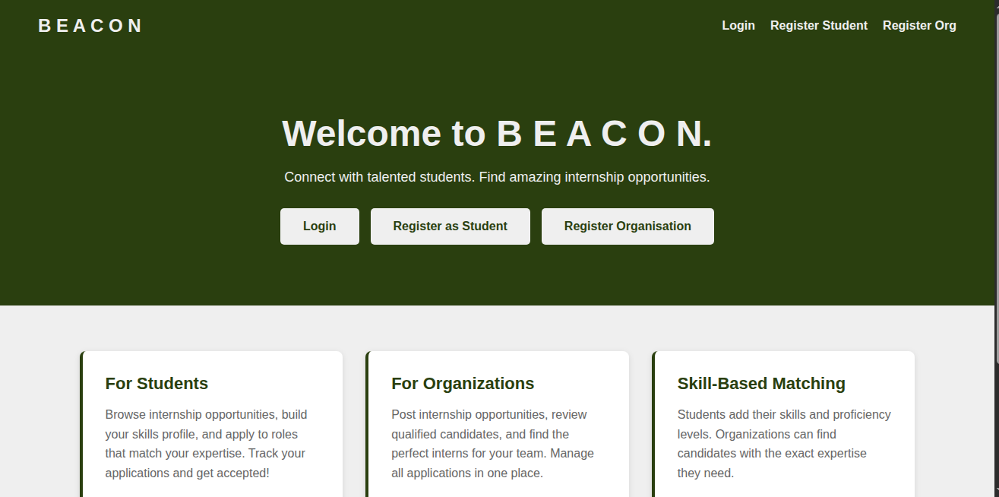
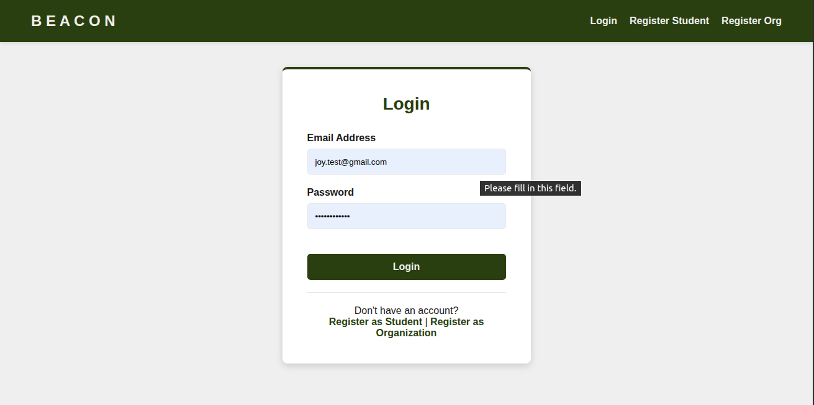
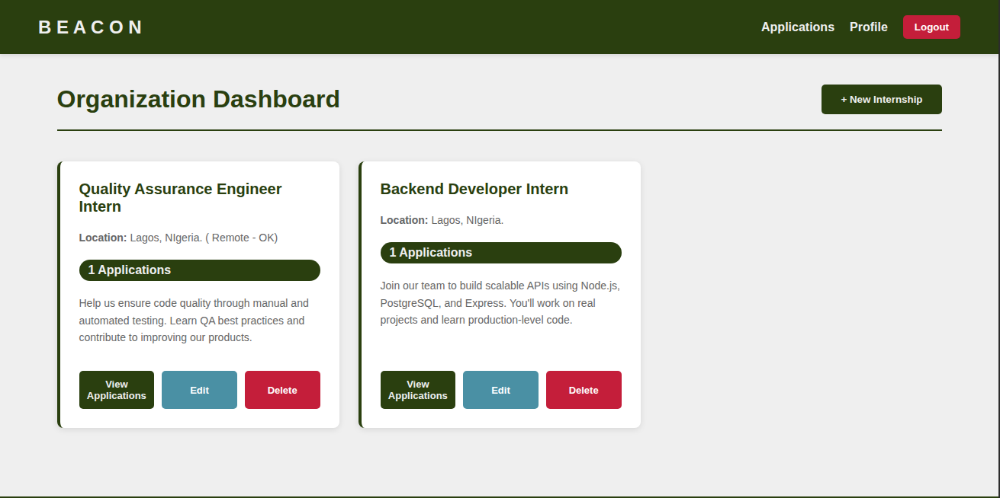
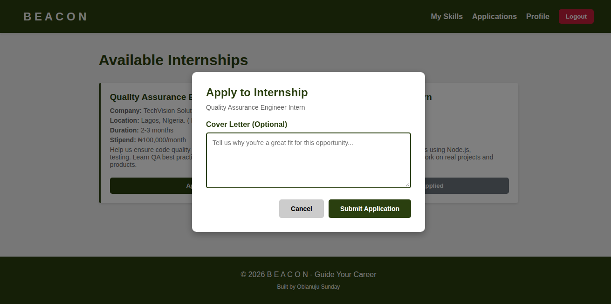
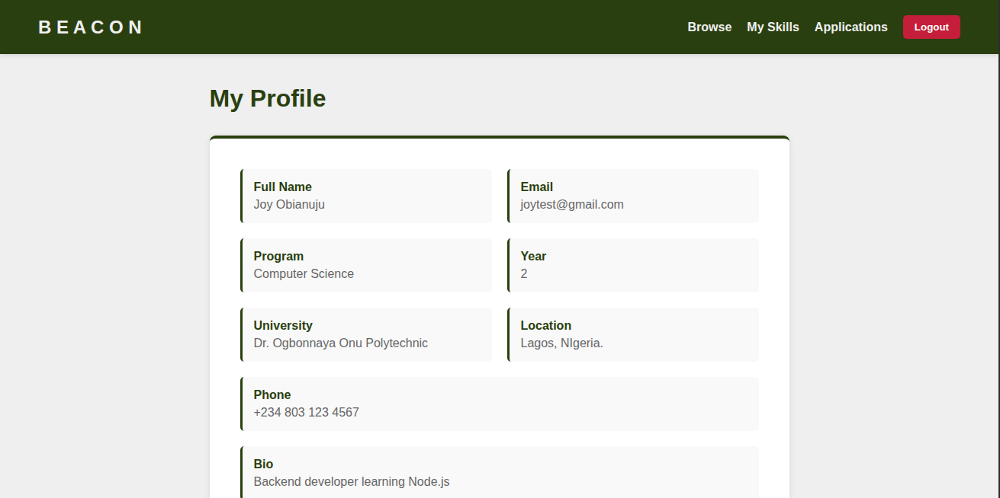
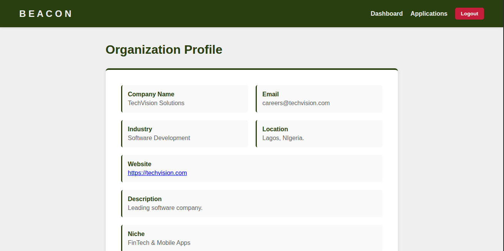
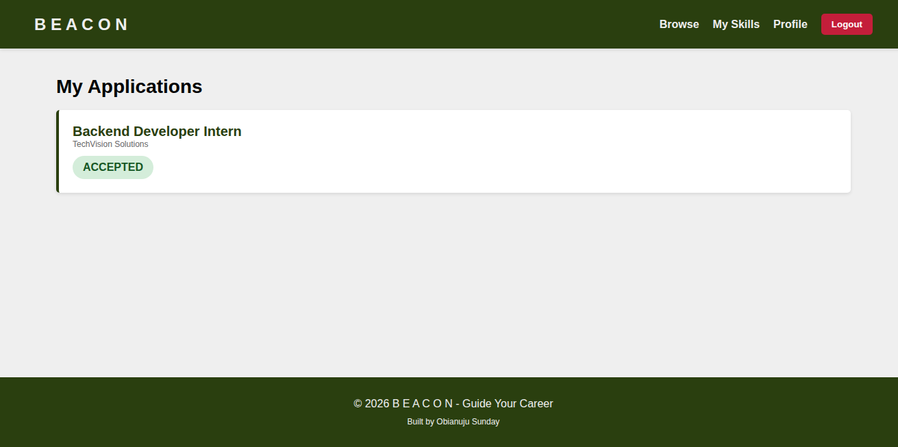
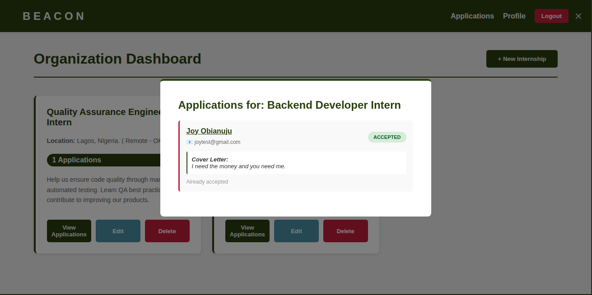
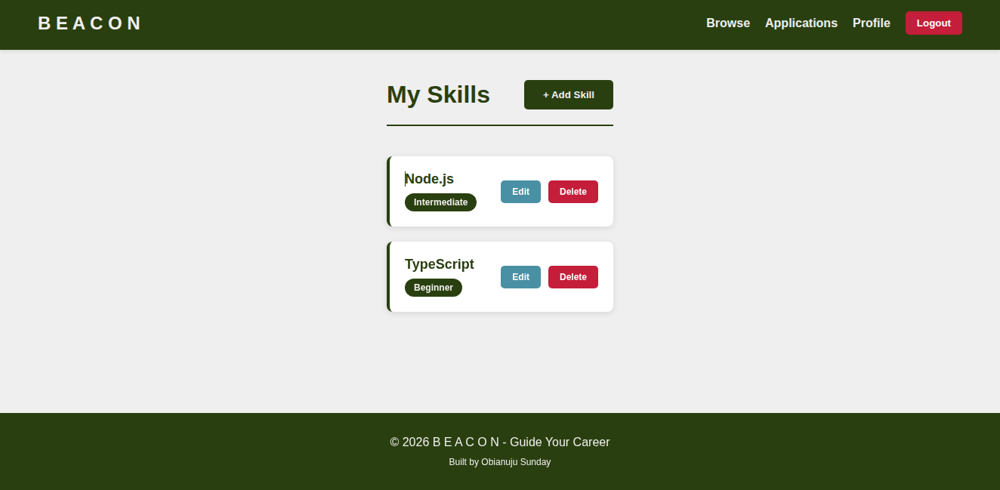
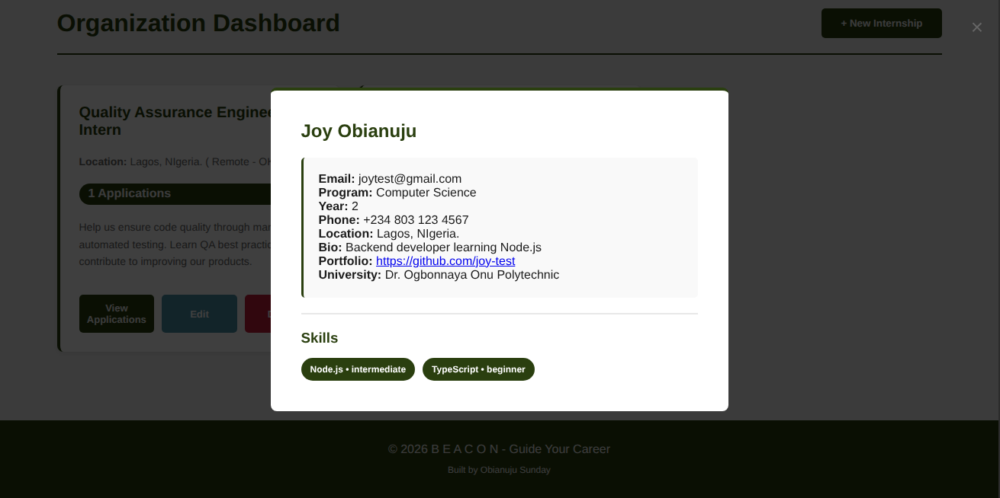

# Student Internship & Skill Profiling System

A full-stack web application connecting students with internship opportunities. Built with Node.js, Express, PostgreSQL, and EJS.

🔗 **Live Demo:** https://internship-system-j3su.onrender.com



##  Features

- **Student Registration & Authentication** - Secure signup with JWT tokens and bcrypt password hashing
- **Organization Registration** - Companies can create profiles to post internships
- **Role-Based Access** - Different dashboards and permissions for students vs organizations
- **Internship Management** - Organizations can post, edit, and manage internship listings
- **Application System** - Students can browse internships and apply with cover letters
- **Application Tracking** - View application status (pending/accepted/rejected)
- **Responsive UI** - Clean minimal design that works on desktop and mobile
- **Security** - Input validation, sanitization, SQL injection prevention, JWT authentication

##  Tech Stack

**Backend:**
- Node.js
- Express.js
- PostgreSQL
- JWT (JSON Web Tokens)
- Bcrypt
- Express-validator

**Frontend:**
- EJS (Embedded JavaScript Templates)
- HTML5
- CSS3 (Custom minimal designs)
- Vanilla JavaScript
- SessionStorage (multi-tab security)

**Deployment:**
- Render (Backend + Database)

##  Database Schema

7 tables with proper relationships:
- `users` - Authentication and role management
- `student_profiles` - Student information
- `organisation_profiles` - Company information
- `skills` - Available skills
- `student_skills` - Student-skill relationships (many-to-many)
- `internships` - Internship postings
- `applications` - Student applications to internships

All tables include proper foreign keys, UNIQUE constraints, and CASCADE deletes for data integrity.

##  Getting Started

### Prerequisites
- Node.js (v14+)
- PostgreSQL (v12+)
- npm or yarn

### Installation

1. **Clone the repository**
```bash
git clone https://github.com/Obianuju-Sunday/backend-journey
cd backend-journey/student-internship-system
```

2. **Install dependencies**
```bash
npm install
```

3. **Create PostgreSQL Database**
```bash
sudo -u postgres psql
CREATE DATABASE internship_system;
\q
```

4. **Set up database schema**
```bash
sudo -u postgres psql -d internship_system -f database/schema.sql
```

5. **Set up environment variables**

Create a `.env` file (copy from `.env.example`):
```bash
PORT=3000
NODE_ENV=development
DB_USER=postgres
DB_PASSWORD=postgres
DB_HOST=localhost
DB_PORT=5432
DB_NAME=internship_system
JWT_SECRET=your_super_secret_key_change_this
JWT_EXPIRES_IN=7d
```

6. **Run the application**
```bash
npm start
```

7. **Open http://localhost:3000**

---

### Test Accounts

Use these accounts to test the application:

**Student Account:**
- Email: joy.test@gmail.com
- Password: TestPass@123

**Organization Account:**
- Email: techvision.new@gmail.com
- Password: OrgPass@789

---

##  Screenshots













##  Key Learning Outcomes

This project taught me:
- Building secure authentication systems with JWT
- Designing relational databases with multiple relationships
- Implementing role-based access control
- Connecting backend APIs to frontend views
- Input validation and sanitization
- Deploying full-stack applications
- Handling multi-tab sessions with sessionStorage

##  Security Features

✅ **Authentication**
- JWT token authentication (24-hour expiration)
- Password hashing with bcrypt (10 salt rounds)
- Role-based access control (student/organisation)

✅ **Data Protection**
- Input validation (express-validator)
- HTML entity escaping (XSS prevention)
- Parameterized SQL queries (SQL injection prevention)
- UNIQUE constraints on critical fields

✅ **API Security**
- Protected routes with middleware
- IDOR prevention (ownership verification in queries)
- SessionStorage for multi-tab security
- Sensitive data never exposed in responses

##  Troubleshooting

### "Database does not exist"
```bash
sudo -u postgres psql -c "CREATE DATABASE internship_system;"
```

### "Connection refused"
```bash
# Check if PostgreSQL is running
sudo systemctl status postgresql

# Start if needed
sudo systemctl start postgresql
```

### "npm ERR! Cannot find module"
```bash
rm -rf node_modules package-lock.json
npm install
```

### Port 3000 already in use
Change `PORT` in your `.env` file to another port (e.g., 3001)

### "Peer authentication failed for user postgres"
```bash
sudo -u postgres psql
```

---

##  For Panel Members (Defence Evaluation)

1. **Extract the CD contents**
2. **Follow Installation section above** (takes ~10 minutes)
3. **Use test accounts** (listed above) to explore all features
4. **Review database structure** in `database/schema.sql`
5. **Check security features** implemented in controllers/middleware
6. **Test full flow:** Register → Login → Browse → Apply → Track Status

The application is fully functional and ready to demonstrate:
- ✅ End-to-end user workflows
- ✅ Secure authentication & authorization
- ✅ Database relationships & integrity
- ✅ Input validation & sanitization
- ✅ Responsive mobile-friendly design

---

##  Future Improvements

- Admin dashboard for approving organizations
- Email notifications for application updates
- Advanced search and filtering
- Resume/portfolio file uploads
- AI-powered skills matching algorithm
- Messaging system between students and organizations
- Analytics dashboard

---

##  Project Structure

```
student-internship-system/
.
├── database
│   └── schema.sql
│
├── images/
│   ├── apply-modal.png
│   ├── homepage.png
│   ├── login.png
│   ├── my-applications.png
│   ├── org-applications.png
│   ├── org-dashboard.png
│   ├── org-student-profile.png
│   ├── student-browse.png
│   └── student-profile.png
│
├── src/
│   ├── config/
│   │   └── db.js
│   │
│   ├── controllers/
│   │   ├── applicationController.js
│   │   ├── authController.js
│   │   ├── internshipController.js
│   │   ├── skillController.js
│   │   └── userController.js
│   │
│   ├── middleware/
│   │   ├── auth.js
│   │   └── validators.js
│   │
│   ├── models/
│   │
│   ├── routes/
│   │   ├── applicationRoutes.js
│   │   ├── authRoutes.js
│   │   ├── dashboardRoutes.js
│   │   ├── internshipRoutes.js
│   │   ├── pages.js
│   │   ├── skillRoutes.js
│   │   └── userRoutes.js
│   │
│   └── views/
│       ├── auth/
│       │   ├── login.ejs
│       │   ├── registerOrganisation.ejs
│       │   └── registerStudent.ejs
│       │
│       ├── layouts/
│       │   ├── footer.ejs
│       │   └── navbar.ejs
│       │
│       ├── org/
│       │   ├── applicationDetails.ejs
│       │   ├── internshipApplications.ejs
│       │   ├── orgDashboard.ejs
│       │   └── profile.ejs
│       │
│       ├── student/
│       │   ├── browseInternships.ejs
│       │   ├── myApplications.ejs
│       │   ├── skillProfile.ejs
│       │   └── student-profile.ejs
│       │
│       ├── error.ejs
│       └── home.ejs
│
├── package.json
├── package-lock.json
├── README.md
├── .env.example
└── server.js
```


---

##  Author

**Sunday Obianuju Joy**

- **LinkedIn:** www.linkedin.com/in/obianuju-sunday
- **GitHub:** https://github.com/Obianuju-Sunday
- **Email:** obianujusunday43@gmail.com
- **Institution:** Dr. Ogbonnaya Onu Polytechnic, Aba
- **Program:** National Diploma in Computer Science (ND2)

---

##  License

This project is open source and available under the MIT License.

---

**Last Updated:** September 2026

**Version:** 1.0.0

**Status:** Ready for Defense.