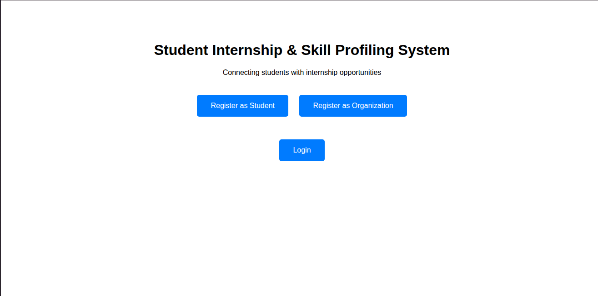
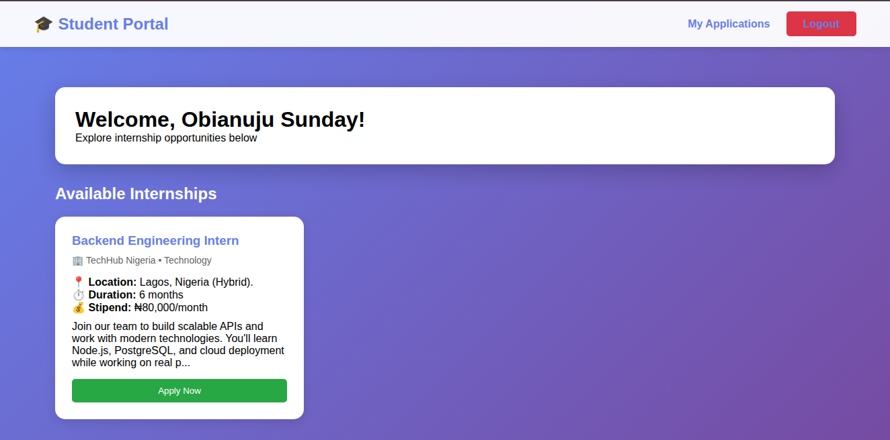
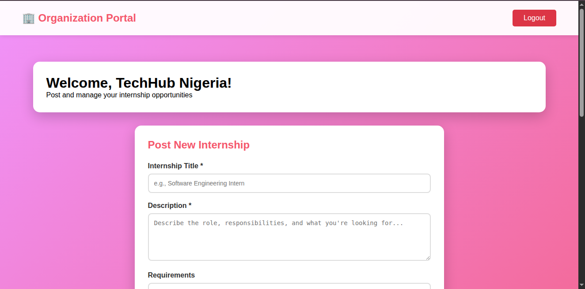

# Student Internship & Skill Profiling System

A full-stack web application connecting students with internship opportunities. Built with Node.js, Express, PostgreSQL, and EJS.

🔗 **Live Demo:** https://internship-system-j3su.onrender.com



##  Features

- **Student Registration & Authentication** - Secure signup with JWT tokens and bcrypt password hashing
- **Organization Registration** - Companies can create profiles to post internships
- **Role-Based Access** - Different dashboards and permissions for students vs organizations
- **Internship Management** - Organizations can post, edit, and manage internship listings
- **Application System** - Students can browse internships and apply with cover letters
- **Application Tracking** - View application status (pending/accepted/rejected)
- **Responsive UI** - Clean gradient design that works on desktop and mobile

##  Tech Stack

**Backend:**
- Node.js
- Express.js
- PostgreSQL
- JWT (JSON Web Tokens)
- Bcrypt

**Frontend:**
- EJS (Embedded JavaScript Templates)
- CSS3 (Custom gradient designs)
- Vanilla JavaScript

**Deployment:**
- Render (Backend + Database)

##  Database Schema

7 tables with proper relationships:
- `users` - Authentication and role management
- `student_profiles` - Student information
- `organization_profiles` - Company information
- `skills` - Available skills
- `student_skills` - Student-skill relationships (many-to-many)
- `internships` - Internship postings
- `applications` - Student applications to internships

##  Getting Started

### Prerequisites
- Node.js (v14+)
- PostgreSQL
- npm or yarn

### Installation

1. Clone the repository
```bash
git clone https://github.com/Obianuju-Sunday/backend-journey
cd backend-journey/student-internship-system
```

2. Install dependencies
```bash
npm install
```

3. Set up environment variables

Create a `.env` file:
```bash 
DB_USER=your_db_username
DB_HOST=localhost
DB_NAME=your_database_name
DB_PASSWORD=your_db_password
DB_PORT=5432
JWT_SECRET=your_secret_key
PORT=3000
NODE_ENV=development
```
    The project supports both individual PostgreSQL config variables and DATABASE_URL for production deployment environments.

4. Run the application
```bash
npm run dev
```

5. Open http://localhost:3000

##  Screenshots





##  Key Learning Outcomes

This project taught me:
- Building secure authentication systems with JWT
- Designing relational databases with multiple relationships
- Implementing role-based access control
- Connecting backend APIs to frontend views
- Deploying full-stack applications

##  Security Features

- Password hashing with bcrypt
- JWT token authentication
- Protected routes with middleware
- Input validation
- SQL injection prevention (parameterized queries)

##  Future Improvements

- Admin dashboard for approving organizations
- Email notifications for application updates
- Advanced search and filtering
- Resume upload functionality
- Skills matching algorithm

##  Author

Obianuju Sunday
- LinkedIn: www.linkedin.com/in/obianuju-sunday
- Email: obianujusunday43@gmail.com
- Portfolio: Coming soon

##  License

This project is open source and available under the MIT License.